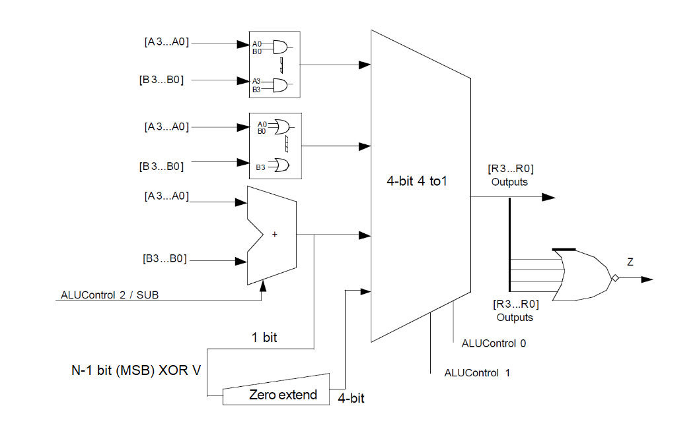

# D0011E Lab 3b (32-bit ALU and Program counter)
The goal of this lab is to implement the ALU and the program counter for the single-cycle 32-bit MIPS processor. It also aims to familiarize the student with sequential circuits in VHDL.

All the VHDL code together with a README file will be uploaded to GitLab. You can commit the whole Vivado project to facilitate reviewers in their task. The README file will include the tables and the answers to the questions in this document, include the text and the index of the question for it to be traced. Remember also to add the images to the zip file you submit in Canvas.

## Part 1
The image below, from quiz 1, introduces a 4-bit ALU which supports ```AND```, ```OR```, ```ADD```, ```SUB``` and ```SLT``` (Set if Less Than) instructions with a zero flag output. The single-cycle MIPS processor has the same architecture.



Using structural VHDL, implement the entire ALU but for 32-bits. You will need to implement and test component by component. (```LogicUnit```, ```ArithmeticUnit```, ```ZeroExtend``` and ```Multiplexer```). The zero flag can be implemented at the main model ALU. 

### ALU entity (top level)

```vhdl
entity ALU_32 is
    port(
        A, B : in std_logic_vector(31 downto 0);
        SUB : in std_logic;
        Op : in std_logic_vector(1 downto 0);
        R : out std_logic_vector(31 downto 0);
        V, C, Z : out std_logic);
end ALU_32;
```

### Logic unit entity
```vhdl
entity LOGIC_32 is
    port(
        A, B, C, D : in std_logic_vector(31 downto 0);
        Op : in std_logic_vector(1 downto 0);
        R : out std_logic_vector(31 downto 0));
end LOGIC_32;
```

### Arithmetic unit entity
```vhdl
entity ARITH_32 is
    port(
        A, B : in std_logic_vector(31 downto 0);
        Sub : in std_logic;
        R : out std_logic_vector(31 downto 0);
        V, C : out std_logic);
end ARITH_32;
```

### Zero extend entity
```vhdl
entity ZeroExtend is
    port(
        A: in std_logic;
        R: out std_logic_vector(31 downto 0));
end ZeroExtend;
```

### Multiplexer entity
```vhdl
entity FOUR_TO_ONE_MUX_32 is
    port(
        A, B, C, D : in std_logic_vector(31 downto 0);
        Op : in std_logic_vector(1 downto 0);
        R : out std_logic_vector(31 downto 0));
end FOUR_TO_ONE_MUX_32;
```

Hint: when modifying the module ```ADDER``` from lab3a, you can use the following generate statement instead of manually instantiating 32 one-bit full adders:

```vhdl
adders: for i in 0 to 31 generat
    adder_instance: FULL_ADDER port map(A(i), ...);
end generate;
```

Replace the dots with appropriate signals. To handle carry bits, you should create and use a 33-bit ```std_logic_vector```, so that ```carry(0)``` is the carry-in to the first full adder, ```carry(1)``` is the carry-out from the first full adder and carry-in to the second fulladder, etc. Then ```carry(32)``` should be the carry-out from the 32nd full adder.

Add tests to the given test bench to test the ALU model for all the five instructions. Don't forget the assert statements.

## Part 2
MIPS processor uses a program counter which increments the memory address by 4 each clock cycle. By using the 32-bit adder, you have implemented in part1, design and implement a model ```PCPlus4``` which consists of 32-bit state register and 32-bit adder. The model should increment its output by 4 after each rising edge of the clock ```clk```. A reset input ```reset``` should reset the models output to zero if it is set to high state, asynchronously.

```vhdl
ENTITY PCPlus4 IS
    PORT(
        Clk: in std_logic;
        Reset: in std_logic;
        Q: out std_logic_vector(31 downto 0)
        );
END PCPlus4
```

As was done in part 1, add the ```PCPlus4``` component to the test bench. It must check that the correct values are stored in the registers and the reset works as in the specifications. Don't forget the assert statements.

# Part 3 Upload the Vivado project and the README file created during the lab, remember:

- **ALU, testing all the five instructions and the zero flag.**
- **Program counter, the output Q of the program counter for few clock cycles and the Q state when the reset is set to high and low states**